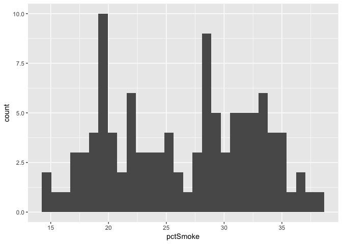

Lesson Template Challenge, Completed
================
Christopher Prener, Ph.D.
(June 28, 2018)

## Introduction

This is a sample notebook that illustrates the notebook template that
should be used for SLU DSS lesson challenges. We’ve provided a little
bit of structure, including a short example of the literate programming
style, to help get you started\!

## Tasks

1.  Load the tabular data set `stlSmoking.csv` into your enviornment
2.  Make a list of the included variables using `dplyr`
3.  Calculate descriptive statistics for the included variables using
    `skmir`
4.  Create a histogram using `ggplot2`

## Load Dependencies

The following code loads the package dependencies.

``` r
# tidyverse packages
library(dplyr)    # data wrangling
```

    ## 
    ## Attaching package: 'dplyr'

    ## The following objects are masked from 'package:stats':
    ## 
    ##     filter, lag

    ## The following objects are masked from 'package:base':
    ## 
    ##     intersect, setdiff, setequal, union

``` r
library(ggplot2)  # data plotting
library(readr)    # work with csv files

# other packages
library(here)    # work with file paths
```

    ## here() starts at /Users/chris/GitHub/DSS/lesson-template

``` r
library(skimr)   # descriptive statistics
```

## Load Data

We’ll use a data set describing smoking rates in St. Louis:

``` r
smoking <- read_csv(here("data", "stlSmoking.csv"))
```

    ## Parsed with column specification:
    ## cols(
    ##   geoID = col_double(),
    ##   tractCE = col_integer(),
    ##   nameLSAD = col_character(),
    ##   pctSmoke = col_double(),
    ##   pctSmoke_Low = col_double(),
    ##   pctSmoke_High = col_double()
    ## )

## Explore Data

### Listing Variables

We’ll start by using the `glimpse()` function from `dplyr` to list all
of the variables and their formats:

``` r
glimpse(smoking)
```

    ## Observations: 106
    ## Variables: 6
    ## $ geoID         <dbl> 29510118100, 29510117400, 29510126700, 295101191...
    ## $ tractCE       <int> 118100, 117400, 126700, 119102, 126800, 126900, ...
    ## $ nameLSAD      <chr> "Census Tract 1181", "Census Tract 1174", "Censu...
    ## $ pctSmoke      <dbl> 27.9, 18.9, 36.8, 15.7, 22.0, 28.8, 27.9, 34.5, ...
    ## $ pctSmoke_Low  <dbl> 24.1, 17.0, 33.1, 12.7, 19.2, 25.1, 23.7, 29.5, ...
    ## $ pctSmoke_High <dbl> 31.7, 20.8, 40.2, 19.9, 24.9, 32.1, 31.8, 38.9, ...

The key variables of interest here are the three variables that begin
with `pct` - they include an estimated smoking prevalence for each
census tract (`pctSmoke`) as well as high and low values based on a
confidence interval for the main estimate. Each of these three variables
is stored as a `dbl` (or “double”) variable, meaning they contain
numeric data suitable for statistical analysis and plotting.

### Descriptive Statistics

Next, we’ll use the `skimr` package to generate descriptive statistics
and visual summaries of our data:

``` r
skim(smoking)
```

    ## Skim summary statistics
    ##  n obs: 106 
    ##  n variables: 6 
    ## 
    ## ── Variable type:character ────────────────────────────────────────────────────────────────────────────────────────────
    ##  variable missing complete   n min max empty n_unique
    ##  nameLSAD       0      106 106  17  20     0      106
    ## 
    ## ── Variable type:integer ──────────────────────────────────────────────────────────────────────────────────────────────
    ##  variable missing complete   n      mean      sd    p0    p25    p50
    ##   tractCE       0      106 106 113385.92 8132.85 1e+05 106425 112350
    ##        p75   p100     hist
    ##  119101.75 127600 ▇▇▅▆▇▃▃▇
    ## 
    ## ── Variable type:numeric ──────────────────────────────────────────────────────────────────────────────────────────────
    ##       variable missing complete   n     mean      sd      p0      p25
    ##          geoID       0      106 106 3e+10    8132.85 3e+10   3e+10   
    ##       pctSmoke       0      106 106    26.4     6.21    14.3    20.38
    ##  pctSmoke_High       0      106 106    29.86    6.25    16.7    23.97
    ##   pctSmoke_Low       0      106 106    23.03    6.07    12.3    17.02
    ##       p50      p75    p100     hist
    ##  3e+10    3e+10    3e+10   ▇▇▅▆▇▃▃▇
    ##     27.65    31.48    37.9 ▃▇▆▅▇▇▇▂
    ##     31.05    35.05    42.8 ▂▇▇▅▇▇▆▂
    ##     23.75    28.35    33.5 ▃▇▅▃▅▆▇▃

For the main estimate, the average smoking prevalence is 26.40% with a
range of 14.30% to 37.9%, meaning that about a quarter of the adult
population of typical census tract smokes with a maximum of more than a
third. The true population value of the estimate is likely to be between
23.03% and 29.86%.

### Histogram

Finally, we’ll create a histogram of the main variable of interest -
`pctSmoke`. We’ll use `ggplot2` to build the plot:

``` r
ggplot() +
  geom_histogram(data = smoking, mapping = aes(pctSmoke))
```

    ## `stat_bin()` using `bins = 30`. Pick better value with `binwidth`.

<!-- -->

We can see that the distribution of smoking prevalence is bimodal -
there are peaks at around 20% of the adult population and again at
around 28% or 29% of the adult population.
