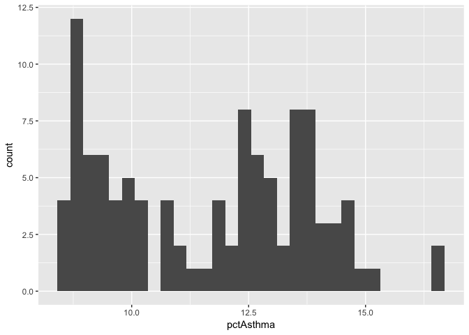

Lesson Template Notebook
================
Christopher Prener, Ph.D.
(March 21, 2018)

Introduction
------------

This is a sample notebook that illustrates the notebook template that should be used for SLU DSS lessons.

Load Dependencies
-----------------

The following code loads the package dependencies for our analysis:

``` r
# tidyverse packages
library(dplyr)    # data wrangling
```

    ## 
    ## Attaching package: 'dplyr'

    ## The following objects are masked from 'package:stats':
    ## 
    ##     filter, lag

    ## The following objects are masked from 'package:base':
    ## 
    ##     intersect, setdiff, setequal, union

``` r
library(ggplot2)  # data plotting
library(readr)    # work with csv files

# other packages
library(here)
```

    ## here() starts at /Users/chris/GitHub/DSS/lesson-template

``` r
library(skimr)
```

    ## 
    ## Attaching package: 'skimr'

    ## The following objects are masked from 'package:dplyr':
    ## 
    ##     contains, ends_with, everything, matches, num_range, one_of,
    ##     starts_with

Load Data
---------

We'll use a data set describing asthma rates in St. Louis:

``` r
asthma <- read_csv(here("data", "stlAsthma.csv"))
```

    ## Parsed with column specification:
    ## cols(
    ##   geoID = col_double(),
    ##   tractCE = col_double(),
    ##   nameLSAD = col_character(),
    ##   pctAsthma = col_double(),
    ##   pctAsthma_Low = col_double(),
    ##   pctAsthma_High = col_double()
    ## )

Explore Data
------------

### Listing Variables

We'll start by using the `glimpse()` function from `dplyr` to list all of the variables and their formats:

``` r
glimpse(asthma)
```

    ## Observations: 106
    ## Variables: 6
    ## $ geoID          <dbl> 29510118100, 29510117400, 29510126700, 29510119...
    ## $ tractCE        <dbl> 118100, 117400, 126700, 119102, 126800, 126900,...
    ## $ nameLSAD       <chr> "Census Tract 1181", "Census Tract 1174", "Cens...
    ## $ pctAsthma      <dbl> 11.9, 9.6, 14.5, 9.0, 9.3, 13.6, 12.7, 12.8, 12...
    ## $ pctAsthma_Low  <dbl> 11.1, 9.3, 13.5, 8.5, 8.8, 12.6, 11.8, 11.7, 11...
    ## $ pctAsthma_High <dbl> 12.7, 10.0, 15.5, 9.7, 9.8, 14.6, 13.8, 14.2, 1...

The key variables of interest here are the three variables that begin with `pct` - they include an estimated asthma prevalence for each census tract (`pctAsthma`) as well as high and low values based on a confidence interval for the main estimate. Each of these three variables is stored as a `dbl` (or "double") variable, meaning they contain numeric data suitable for statistical analysis and plotting.

### Descriptive Statistics

The `skimr` package provides an excellent descriptive statistics function called `skim()` that we can use to get quick numeric and visual(!) summaries of our data:

``` r
skim(asthma)
```

    ## Skim summary statistics
    ##  n obs: 106 
    ##  n variables: 6 
    ## 
    ## Variable type: character 
    ##  variable missing complete   n min max empty n_unique
    ##  nameLSAD       0      106 106  17  20     0      106
    ## 
    ## Variable type: numeric 
    ##        variable missing complete   n      mean      sd      p0       p25
    ##           geoID       0      106 106  3e+10    8132.85 3e+10    3e+10   
    ##       pctAsthma       0      106 106     11.61    2.15     8.5      9.5 
    ##  pctAsthma_High       0      106 106     12.48    2.39     9       10.15
    ##   pctAsthma_Low       0      106 106     10.85    1.93     8        8.93
    ##         tractCE       0      106 106 113385.92 8132.85 1e+05   106425   
    ##     median       p75     p100     hist
    ##   3e+10     3e+10     3e+10   ▇▇▅▆▇▃▃▇
    ##      12.05     13.47     16.5 ▇▃▂▅▆▅▁▁
    ##      12.95     14.5      18.2 ▇▅▂▅▆▅▁▁
    ##      11.35     12.6      15   ▇▆▂▃▆▇▂▁
    ##  112350    119101.75 127600   ▇▇▅▆▇▃▃▇

`skim()` segregates variables based on their type, unlike the base `R` `summary()` function. It also provides a small histogram for each distribution, which allows for easy comparison, and other summary statistics both for individual variables and the data set as a whole.

### Histogram

Finally, we'll create a histogram of the main variable of interest - `pctAsthma`. We'll use `ggplot2` to build the plot:

``` r
ggplot() +
  geom_histogram(data = asthma, mapping = aes(pctAsthma))
```

    ## `stat_bin()` using `bins = 30`. Pick better value with `binwidth`.



We can see the a large number of census tracts have low asthma rates (below 10%). However, there are a sizeable cluster of tracts with rates between 12 and 15% with several tracts that have even higher rates.
